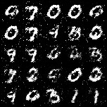
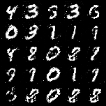
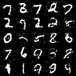
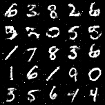

# mnist-gan
PyTorch implementation of a simple GAN for generating MNIST digits

## Setup

Only tested with Python 3.8.1, though it would likely work with other Python 3 versions.

`pip install torch torchvision`

## Running

Run the network with `python gan.py` and it wiill download MNIST and run for 200 epochs. On my laptop, this took a few hours, but after less than an hour there were only slight improvements (see [20000th batch](images/20000.png)).

This was implemented from scratch with some optimizations from [eriklindernoren/PyTorch-GAN](https://github.com/eriklindernoren/PyTorch-GAN/tree/master/implementations/gan).

## Examples

Number of batches: 8000, 20000, 80000, 119000

